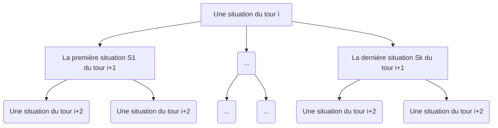

# TIPE

## Accès au jeu [ici](https://dovalek.github.io/TIPE/index.html)

## Objectifs / Déroulement
Créer une variante unique des échecs pour ce TIPE

Implémenter, en ligne si possible, cette variante des échecs

Trouver, s'il en existe, des propriétés mathématiques ou d'algorithmie dans l'optique de mieux comprendre les stratégies propres à cette variante

Développer un alogrithme ou une IA utilisant ces propriétés pour jouer contre un autre joueur
   
Tenter, si possible, d'occtroyer à ce joueur non humain différentes stratégies que le joueur adversaire (humain) pourra choisir (style défensif, modéré, aggressif)

#### Outils
Usage de HTML, JavaScript, CSS pour l'interface.

Usage de OCcaml pour la partie algorithmie, avec une liaison à l'interface via un fichier json et [yojson](https://ocaml-community.github.io/yojson/yojson/Yojson/index.html).

#### Principe
Contrairement à la version traditionnelle, les deux joueurs jouent ici en même temps durant un tour

Pour des raisons évidentes, un tour doit avoir une durée limitée pour garantir une fin de partie, cette durée sera fixée si possible durant l'implémentation

> Durant toute la phase de recherche de propriétés, cette condition sera supposée remplie

Pour simplifier, les éventuelles collisions entre pièces ennemies (soit lorsque deux pièces de déplacent vers la même case) lors d'un même tour résultera en un retour aux cases initiales


## Tentatives d'estimation de l'ordre du nombre de coups possibles

### Cas du tour initial

Au tour initial on a :
 - 8 pions pouvant faire 2 mouvements différents chacuns
 - 2 cavaliers pouvant faire 2 mouvements différents chacuns
> Les autres pièces sont bloquées, d'où leur absence

Ainsi on a pour un camp 20 mouvements possibles au premier tour.

Dans notre variante, les mouvements noirs et blancs étant simultanés, on a alors 400 ouvertures différentes possibles, et cela dés le premier tour!

### Généralisation du nombre de différentes parties possibles après n tours

Soit $T=(T_n)_{n \in N *}$ la suite représentant le nombre de parties différentes existant avec $n$ tours.
On pose $T_1$=400.

En gardant la notation $B = (b_1, ..., b_{16})$, $N = (n_1, ..., n_{16})$, on définit

$M_{B_n}$ et $M_{N_n}$ l'ensemble des mouvements différents des éléments de $B$ et $N$ lors du tour n.

On suppose que ceci est vrai

> On a le même nombre de situations possibles dans les fils directs (S1, .., Sk)

On a alors $T_n = \prod_{k\in[1, n]} ((\sum_{i\in M_{B_k}}{i})(\sum_{j\in M_{B_k}}{j})) = T_{n-1} (\sum_{i\in M_{B_n}}{i})(\sum_{j\in M_{B_n}}{j})$

> Bien que cela nécessite une conditions puissante, $(\sum_{i\in M_{B_k}}{i})(\sum_{j\in M_{B_k}}{j})$ devant être constant quelque soit la situation d'un même tour, cela est suffisant pour avoir une estimation du nombre fins possibles.

### Application simple

Par besoin de simplification, posons un nombre limité de tours, qui aura pour conséquance de qualifier toute partie à plus de tours comme nulle.

De même, nous nous simplifierons la tâche en supposant que le nombre mouvements possibles pour chaque camp est d'environ 20.
Dans ce cas le nombre de dispositions de pièces au prochain tour est 400.

On a alors $T_{40} = 400^{40} = 2^{80}10^{80} \approx 10^{120}$

Or ceci est le [nombre de Shannon](https://fr.wikipedia.org/wiki/Nombre_de_Shannon), un nombre déterminant le nombre de coups possibles dans une partie.

__Consequence :__ Si cette représentation est cohérente avec le jeu, alors l'ordre du nombre de coups possible dans notre variante est le même que celui de la version traditionnelle.

De plus, le nombre de coups possibles d'un tour à l'autre étant évidemment plus grand dans notre variante, dû à la simultanéité des mouvements noirs et blancs, alors l'arbre des mouvements possibles de notre variant n'est qu'une version "compréssée" de l'arbre traditionnel.


## Idées d'algorithmes pour un mouvement de pièce

### Permières idées

#### Idée 1

L'algorithme examine pour toutes ses pièces 
- leurs mouvements possibles
- les possibles mouvements les menacant
A partir ce cela, on détermine une liste de mouvements dont celui joué est celui jugé le plus important. L'importance est déterminée par la nature de la pièce (reine, fou, pion...)

#### Idée 2

Pour toutes les pièces n'étant pas un pion, on a la liste de priorités suivante :
  - Roi
  - Reine
  - Auters pièces ayant un certain nombre de pièces ennemies dans un certain rayon

Ainsi on divise par 2 (grossièrement) le nombre d'opérations


#### Inconvéniants

Ces algorithmes donnent une réponse court terme à une situatation.
Une solution à cela serait un un arbre de possibilités via un algorithme backtracking, pour que l'algorithme sélectionne le choix lui paraissant le plus optimal.

### Backtracking 

On crée une structure (probablement arborescente) de données associant toutes les situation possibles à une valeur numérique pour que l'algorithme puisse l'exploiter pour jouer.
On la crée indépendemment pour éviter de la recréer à chaque tour.

Ainsi on élaborera aussi des algoritmes permettant de déterminer les pièces pouvant bouger et les mouvements possbles dans le cas échéant.

Par conséquant, il suffira à chaque coup de regarder les fils associés et répeter cela jusqu'à avoir la victoire la plus proche, ou le score le plus élevé, ou un match nul selon la situation...

#### Inconvéniants

A partir du bilan donné précedemment, on peut se questionner sur la possibilité de générer un tel arbre sur machine.

### Glouton

Le glouton sélectionne la situation liée à un extremum des valeurs associées.

> Selon l'algo glouton choisi, il peut être possible de simuler différents types de jeu.

### Min-max

Lors d'un tour $i$, l'algorithme génère les situations des 2 tours suivants et leur associe leurs valeurs.

Ensuite, pour toutes les situations $S = (s_{i+1, 1}, ..., s_{i+1, k})$ du tour $i+1$, on leur associe une situation du tour $i+2$ notée $M = (m_1, ..., m_k)$, dont les valeurs associées représentent un extremum des situations liées à celles de $S$.

Ensuite, on note $m$ l'extremum opposé des éléments de $M$.

On a alors une $l$-ième situation du tour $i+1$ telle que $m=m_l$.

On sélectionne alors le mouvemnt allié associé à la $l$-ième situation comme le coup à jouer.

> Avec un algo ressemblant à celui-ci, on peut se rammener à un algo jouant virtellement à une version traditionnelle des échecs
> En effet, il lui suffit de trouver un coup optimal pour chaque mouvement que l'adversaire peut faire.
> Ensuite, en fonction de la pièce bougée par le jouer, l'algo soummet sa pièce.

> Cependant, avec cet algo, il est impossible avoir joueur non hunain contre un autre joueur non humain.

## Manières d'estimer la pertinence d'un coup

### Idée de la (des) constante(s)

A chaque situatuion, on associe en fonction des positions des pièces et de leur nombre des valeurs associées à l'optimalité du coup.

Pour simplifier, nous nous contenterons de créer une multitude de valeurs, pour ensuite en faire une moyenne dans le cas de la valeur unique.

### Notions prises en compte

Les notions considérées seront

i) Le nombre de pièces des 2 camps

ii) La mise en danger des pièces ennemies par les picèes alliées

iii) La capacité de protection des pièces alliées

## Idées de structures pour l'implémentation

### Stockage des plateaux

On pourra implémenter la totalité des coups possibles par un arbre de couples plateau * constante associée

Les plateaux seront sous la forme de tableaux ou de matrices, où l'on aura la nomenclature suivante
| Code | Signification |
|----|------------|
|'v'|Case vide|
|'p'|Pion|
|'t'|Tour|
|'c'|Cavalier|
|'f'|Fou|
|'r'|Reine|
|'k'|Roi|

A ces pièces on associera la couleur.
Ainsi une case sur laquelle est situé un fou noir sera de la forme
```
('f', 'n')
```
> Remarque : pour les cases vides, on mettra par convention un espace en second caractère

Ainsi par exemple, si est choisie une implémentation en OCaml avec une matrice, on aura pour le plateau de début de partie avec le cas d'une unique constante :
```
let p0 =
[|
[|('t', 'n'); ('c', 'n'); ('f', 'n'); ('r', 'n'); ('k', 'n'); ('f', 'n'); ('c', 'n'); ('t', 'n')|];
.....
|]
type arb = Vide | Noeud of ( (char*char Array Array)*int) * arb list;;
let exemple = Noeud((p0, 0), [Vide]);;
```
> On associe par convention 0 au plateau p0

#### Inconvéniants

Cela est très gourmand en mémoire...

### Stockage des pièces modifiées

A chaque situation, on associe 
- Les 2 pièces ayant bougées
- Les 2 pièces potentiellemnt capturées

Les positions seront initialisées au premier tour, avec la disposition standart.

Ainsi, on peut prouver par récurrnce qu'on aura à chaque tour la disposition des pièces.

| Code | Signification |
|----|------------|
|'o'|Aucune picèes (dans le cas des pièces capturées)|
|'p'|Pion|
|'t'|Tour|
|'c'|Cavalier|
|'f'|Fou|
|'r'|Reine|
|'k'|Roi|

A ces pièces on associera la couleur.

A cette pièce, on associe
- 2 coordonnées s'il s'agit d'une pièces qui bouge
- 1 coordonnée si elle est capturée (son dernier emplacement)

Une coordonée est représentée par un couple d'entiers.

> Si aucune pièces n'est capturée, peu importe la coordonée associée car elle ne sera pas lue.

Anisi par exemple, en OCaml, on aura :

```
type pieceBouge = (char*char) * ((int*int) * (int*int));;
type pieceCapturee = (char*char) * (int*int);;
type arb = Vide | Noeud of ( pieceBouge * pieceBouge * pieceCapturee * pieceCapturee ) * arb list;;
```

#### Inconvéniants

La déclaration des positions initiales est un peu plus ambigue...
Il fadrait de plus différencier les doublons de pièces de même type pour indiquer quelle pièce a bougé (bien que cela est possible sans, cela ne garantit pas d'accès à une pièce en O(1)).

### Stockage général des pièces

A chaque situation, on associe les 32 pièces du plateau, leur position, un booléen indiquant si elle est capturée.

Par exemple, en conservant une nomenclature similaire à celles ci-dessus, on aurait en OCaml
```
type piece = (char*char)*(int*int)*bool;;
type plateau = piece array;;
type score = int;; (*la représentation score est sujet au changement*)
type arbre = Vide | Noeud of (plateau * score) * arbre list;;
```
Cette représentation est d'ailleurs celle qui sera finalement choisie pour l'implémentation.


## Meilleure estimation du nombre de coups

### Relevés de parties

Pour mieux cerner les variations du nombre de coups possibles, il est possible de faire un certain nombre de parties et de relever le nombre de mouvemets possibles à chaque tour pour chaque pièce.

On essaiera dans le TIPE de faire jouer plusieurs fois deux joueurs non humains contre eux dans cette optique.

Après avoir receuilli les données, on pourra tenter de trouver un comportement asymptoique du nombre de coups possibles pour chaque pièce en fonction de l'avancement dans la partie.

Cela permettra de détermnier si l'estimation faite plus haut est pertinente.
