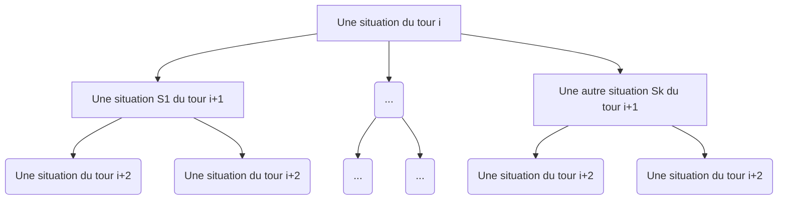

# Tentatives d'estimation de l'ordre du nombre de coups possibles

## Cas du tour initial

Au tour initial on a :
 - 8 pions pouvant faire 2 mouvements différents chacuns
 - 2 cavaliers pouvant faire 2 mouvements différents chacuns
> Les autres pièces sont bloquées, d'où leur absence

Ainsi on a pour un camp 20 mouvements possibles au premier tour.

Dans notre variante, les mouvements noirs et blancs étant simultanés, on a alors 400 ouvertures différentes possibles, et cela dés le premier tour!

## Cas d'un tour quelconque

Lors d'un tour $T_n$, on a

$B = (b_1, ..., b_{16})$ les pièces blanches pouvant faire respectivement $M_B = (M_{b_1}, ..., M_{b_{16}})$ mouvements différents

$N = (n_1, ..., n_{16})$ les pièces noires pouvant faire respectivement $M_N = (M_{n_1}, ..., M_{n_{16}})$ mouvements différents

> Si une pièce $p\in N \cup B$ ne peut pas bouger, alors $M_p = 0$

On pose alors

$C_B = \sum_{m\in M_B}{m}$ le nombre de mouvements blancs possibles

$C_N = \sum_{m\in M_N}{m}$ le nombre de mouvements noirs possibles

On a donc

Q = $C_B C_N$ le nombre des différentes situations lors du prochain tour noté $T_{n+1}$.
Notons l'ensemble contenant ces situations P.

Maintenant notons Q' le nombre des différentes possibilités lors du prochain tour $T_{n+1}$ d'une des situations de P.
De la même manière, on a P' tel que Card(P') = Q'

Si est faite l'hypothèse que les nombres de situations possibles est équivalent dans les éléments de P', on peut alors définir le nombre des différentes situations possibles après $T_{n}$ et $T_{n+1}$ noté $\mathcal{Q}$ de la manière suivante

$\mathcal{Q}$=Q Q'

## Généralisation du nombre de différentes parties possibles après n tours

Soit $T_n$ la suite représentant le nombre de parties différentes existant avec n tours.
On définit $T_0$=1 et $T_1$=400.

En gardant la notation $B = (b_1, ..., b_{16})$, $N = (n_1, ..., n_{16})$, on définit

$M_{B_n}$ et $M_{N_n}$ l'ensemble des mouvements différents des éléments de $B$ et $N$ lors du tour n.

On suppose que ceci est vrai

> On a le même nombre de situations possibles dans les fils directs (S1, .., Sk)

On a alors $T_n = \prod_{k\in[0, n]} ((\sum_{i\in M_{B_k}}{i})(\sum_{j\in M_{B_k}}{j})) = T_{n-1} (\sum_{i\in M_{B_n}}{i})(\sum_{j\in M_{B_n}}{j})$

> Bien que cela nécessite une conditions puissante, $(\sum_{i\in M_{B_k}}{i})(\sum_{j\in M_{B_k}}{j})$ devant être constant quelque soit la situation d'un même tour, cela est suffisant pour avoir une estimation du nombre fins possibles.

## Application simple

Par besoin de simplification, posons un nombre limité de tours, qui aura pour conséquance de qualifier toute partie à plus de tours comme nulle.

De même, nous nous simplifierons la tâche en supposant que 
